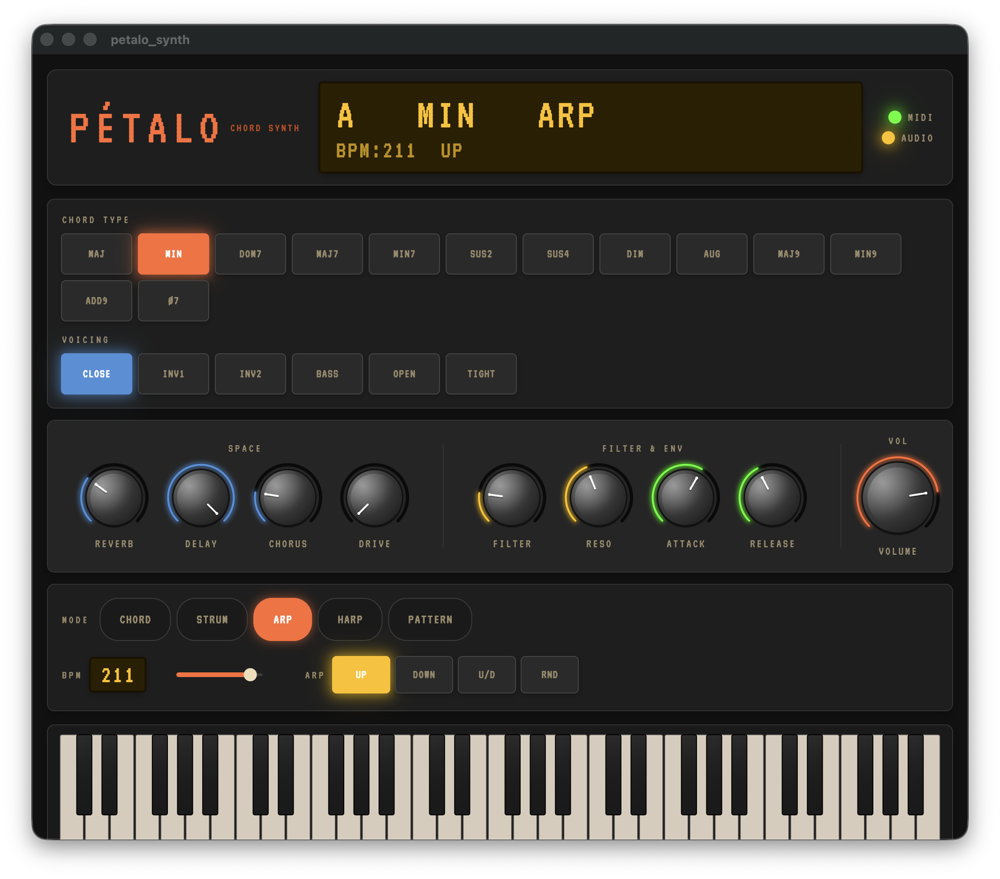
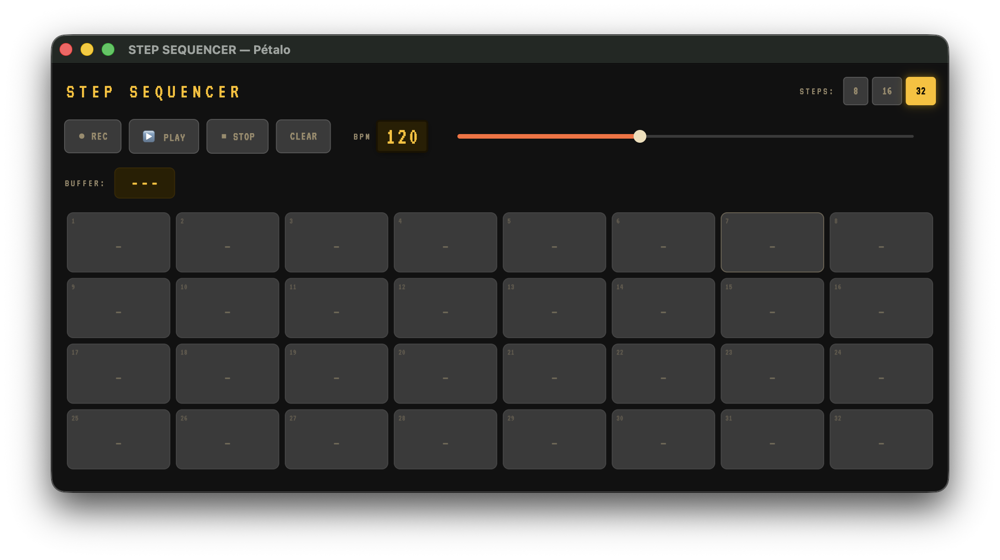

# Pétalo — Chord Synth

Un sintetizador generador de acordes para escritorio (macOS/Windows) inspirado en el [Orchid by Telepathic Instruments](https://telepathicinstruments.com/). Conecta un teclado MIDI y convierte cada nota que tocas en un acorde completo, con voice leading automático y varios modos de performance.



---

## ¿Qué hace?

Tocas **una nota** en tu teclado MIDI → Pétalo genera un **acorde completo** según el tipo que hayas seleccionado, optimiza el movimiento de voces respecto al acorde anterior, y lo reproduce usando un soundfont SF2.

Además incluye un **Step Sequencer** en ventana OS independiente — puedes tenerlo al lado de la pantalla principal mientras tocas:



---

## Requisitos

- macOS (probado en macOS 15 Sequoia)
- Flutter 3.41+ instalado
- Un teclado MIDI conectado por USB (probado con Arturia Keystep 32)
- CocoaPods: `brew install cocoapods`

---

## Instalación

```bash
git clone https://github.com/matbutom/arturia-keystep-app.git
cd arturia-keystep-app/petalo_synth

# Copiar el soundfont nativo de macOS (recomendado para mejor audio)
cp /System/Library/Components/CoreAudio.component/Contents/Resources/gs_instruments.dls \
   assets/soundfonts/gs_instruments.dls

# Instalar dependencias
flutter pub get

# Correr la app
flutter run -d macos
```

Si no copias `gs_instruments.dls`, la app usará `TimGM6mb.sf2` como fallback automático (ya incluido en el repo).

---

## Interfaz

### Display LED
Muestra el estado actual en tiempo real:
- **Nota raíz** — la nota que estás tocando (C, D#, G, etc.)
- **Tipo de acorde** — MAJ, MIN, DOM7, MAJ7, SUS2, etc.
- **Modo activo** — CHORD, STRUM, ARP, HARP, PATTERN
- **BPM** y dirección del arpeggiador

Los indicadores **MIDI** (verde) y **AUDIO** (naranja) en la esquina superior derecha muestran si los dispositivos están conectados y listos.

---

### Chord Type — Tipo de acorde

Selecciona el tipo de acorde que se genera al tocar una nota:

| Botón | Acorde | Intervalos |
|-------|--------|-----------|
| MAJ | Mayor | 1 - 3 - 5 |
| MIN | Menor | 1 - b3 - 5 |
| DOM7 | Dominante 7ª | 1 - 3 - 5 - b7 |
| MAJ7 | Mayor 7ª | 1 - 3 - 5 - 7 |
| MIN7 | Menor 7ª | 1 - b3 - 5 - b7 |
| SUS2 | Suspendido 2ª | 1 - 2 - 5 |
| SUS4 | Suspendido 4ª | 1 - 4 - 5 |
| DIM | Disminuido | 1 - b3 - b5 |
| AUG | Aumentado | 1 - 3 - #5 |
| MAJ9 | Mayor 9ª | 1 - 3 - 5 - 7 - 9 |
| MIN9 | Menor 9ª | 1 - b3 - 5 - b7 - 9 |
| ADD9 | Add 9 | 1 - 3 - 5 - 9 |
| #7 | Semidisminuido | 1 - b3 - b5 - b7 |

---

### Voicing — Disposición de voces

Modifica cómo se distribuyen las notas del acorde:

| Botón | Efecto |
|-------|--------|
| **CLOSE** | Disposición cerrada (notas juntas) |
| **INV1** | Primera inversión (la tercera en el bajo) |
| **INV2** | Segunda inversión (la quinta en el bajo) |
| **BASS** | Añade la nota raíz una octava abajo |
| **OPEN** | Disposición abierta (notas más separadas) |
| **TIGHT** | Comprime el acorde a una octava |

---

### Knobs — Controles de sonido

**SPACE** (izquierda):
- **Reverb** — cola de reverberación
- **Delay** — eco/delay
- **Chorus** — modulación de chorus
- **Drive** — saturación/distorsión

**Filter & Env**:
- **Filter** — frecuencia de corte del filtro
- **Reso** — resonancia del filtro
- **Attack** — tiempo de ataque de la envolvente
- **Release** — tiempo de caída

**VOL** (derecha): Volumen general de salida.

> El Mod Wheel del Keystep controla Reverb. CC7 controla volumen. CC74 controla el filtro.

---

### Mode — Modos de performance

Cambia cómo se reproduce el acorde cuando tocas una tecla:

| Modo | Descripción |
|------|-------------|
| **CHORD** | Todas las notas suenan juntas simultáneamente |
| **STRUM** | Las notas se arpegizan rápido de abajo a arriba (como rasgar una guitarra) |
| **ARP** | Arpeggiador con BPM y patrón configurable |
| **HARP** | Las notas se tocan en cascada con timing musical |
| **PATTERN** | Patrón rítmico (igual que CHORD en v1) |

#### Arpeggiador (cuando Mode = ARP)

- **BPM** — velocidad del arpeggiador (slider + valor numérico)
- **ARP** — patrón: **UP** (ascendente), **DOWN** (descendente), **U/D** (arriba-abajo), **RND** (aleatorio)

---

### Step Sequencer — ventana OS independiente

El botón **[SEQ]** del header abre el sequencer como una **ventana nativa separada** del sistema operativo. Puedes moverla libremente y tenerla al lado de la ventana principal.

El sequencer graba **acordes completos** (no notas sueltas) en cada paso. Cada celda muestra la nota raíz, el tipo de acorde y el voicing.

#### Controles de transporte

| Control | Función |
|---------|---------|
| **● REC** | Activa el modo grabación — el siguiente acorde que toques en el Keystep se guarda en el paso que clickees |
| **▶ PLAY** | Inicia la reproducción del loop |
| **■ STOP** | Para y vuelve al paso 0 |
| **CLEAR** | Borra todos los pasos |

#### BUFFER

Muestra el acorde actualmente "en buffer" (el último que tocaste en el Keystep). Cuando REC está activo, clickear un paso graba ese acorde en él.

#### Grid de pasos

- **STEPS** — selecciona entre 8, 16 o 32 pasos
- **Click** en un paso vacío → lo activa/desactiva (toggle)
- **Click** en REC activo → graba el buffer en ese paso
- **Long press** → borra el paso
- El paso activo durante la reproducción se ilumina en naranja

#### BPM

El slider de BPM del sequencer está sincronizado con el slider principal — cambiar uno actualiza el otro en tiempo real.

---

### Teclado

El teclado en la parte inferior muestra en tiempo real qué notas están sonando, iluminadas en naranja. Cubre 5 octavas (C2–B6).

---

## Voice Leading

La app aplica **voice leading automático**: cuando cambias de acorde, cada voz se mueve a la nota más cercana disponible en el nuevo acorde, minimizando los saltos. Esto produce transiciones más suaves y naturales, como haría un músico real.

---

## Estructura del código

```
petalo_synth/
├── lib/
│   ├── core/
│   │   ├── chord_engine.dart      # Generación de acordes
│   │   ├── voice_leading.dart     # Optimización de voces
│   │   ├── arp_engine.dart        # Modos de performance
│   │   └── sequencer_engine.dart  # Motor del step sequencer (Timer)
│   ├── midi/
│   │   └── midi_service.dart      # Input MIDI (flutter_midi_command)
│   ├── audio/
│   │   └── audio_service.dart     # Reproducción SF2 (flutter_midi_pro)
│   ├── models/
│   │   ├── synth_state.dart         # Estado global del sintetizador
│   │   ├── step_sequencer_state.dart # Estado del step sequencer
│   │   └── sequencer_view_state.dart # Proxy state en la sub-ventana
│   └── ui/
│       ├── screens/
│       │   ├── main_screen.dart
│       │   └── sequencer_window_app.dart  # App de la ventana del sequencer
│       ├── theme/retro_theme.dart
│       └── widgets/               # Knobs, pads, teclado, display
├── packages/
│   └── flutter_midi_pro/          # Fork local con fix de audio macOS
│       └── macos/Classes/FlutterMidiProPlugin.swift
└── assets/
    ├── soundfonts/                 # SF2/DLS soundfonts
    └── fonts/VT323-Regular.ttf    # Fuente retro
```

---

## Soundfonts

La app prueba estos soundfonts en orden, usando el primero que funcione:

1. `gs_instruments.dls` — soundfont GM nativo de macOS *(no incluido, copiar manualmente)*
2. `TimGM6mb.sf2` — GM compacto open source *(incluido)*
3. `VintageDreamsWaves.sf2` — synth FM *(incluido)*

El instrumento por defecto es **GM #4 (Electric Piano / Rhodes)**.

---

## Dependencias principales

| Paquete | Uso |
|---------|-----|
| `flutter_midi_command` | Recepción de mensajes MIDI desde el Keystep |
| `flutter_midi_pro` (fork) | Reproducción de soundfonts SF2/DLS via AVAudioEngine |
| `provider` | Gestión de estado con ChangeNotifier |
| `desktop_multi_window` | Ventana OS independiente para el step sequencer |
| `window_manager` | Control de tamaño y título de ventanas secundarias |
